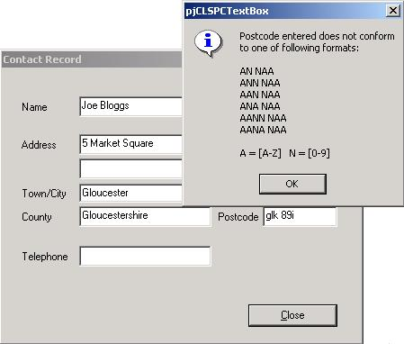



## UK Postcode / Postal Code Format Validation Class \*UPDATED\*

### Description

If you are using a text box to input a UK postcode, the text box can be attached to this class, which will then ensure the text entered is UCase & conforms to a valid UK Postal Code format.

I have add a new function to the class which enables Multimap Lookup. (Thanks to Jon Webb for that code.)

Cheers also to Simon Woollard for pointing out the changes that were needed.
 
### More Info
 
Text Box Object

             |
---                |---
**Submitted On**   |2003-03-14 12:13:04
**By**             |[Nicholas Andrews](https://github.com/Planet-Source-Code/PSCIndex/blob/master/ByAuthor/nicholas-andrews.md)
**Level**          |Intermediate
**User Rating**    |4.5 (18 globes from 4 users)
**Compatibility**  |VB 6\.0
**Category**       |[String Manipulation](https://github.com/Planet-Source-Code/PSCIndex/blob/master/ByCategory/string-manipulation__1-5.md)
**World**          |[Visual Basic](https://github.com/Planet-Source-Code/PSCIndex/blob/master/ByWorld/visual-basic.md)
**Archive File**   |[UK\_Postcod1560933172003\.zip](https://github.com/Planet-Source-Code/nicholas-andrews-uk-postcode-postal-code-format-validation-class-updated__1-44000/archive/master.zip)

### API Declarations

ShellExecute

